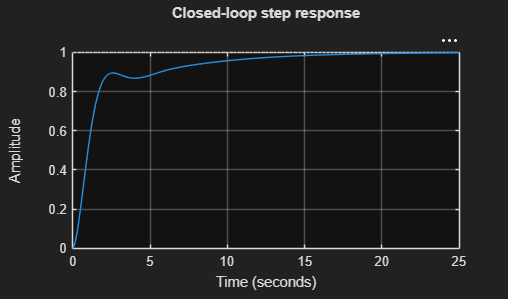

# MATLAB simulation

MATLAB simulation for control systems means using MATLAB (and Simulink) to model, analyze, design, and validate dynamic controllers and the plant they act on. It replaces or augments hand analysis with numerical simulation so you can test behavior (time and frequency domain), tune controllers, and verify robustness before hardware implementation.

Key points
- Purpose: evaluate system response (step, impulse, disturbance), design controllers (PID, state-feedback, LQR), and verify performance/robustness.
- Tools: Control System Toolbox (tf, ss, bode, step, lsim), Robust Control Toolbox, Simulink for block-diagram simulation, Simscape for physical modeling, and PID Tuner.
- Typical workflow:
    1. Build a plant model (transfer function or state-space) or import data/linearize a Simulink model.
    2. Analyze open-loop properties (bode, nyquist, margin, poles/zeros).
    3. Design controller (tuning rules, optimization, state feedback).
    4. Simulate closed-loop time responses and disturbances (step, lsim).
    5. Iterate and test robustness (parametric variations, noise).
    6. Deploy (code generation, hardware-in-the-loop).

Minimal example (MATLAB)
```matlab
% second-order plant and step response with a PID
num = 1;
den = [1 2 1];      % s^2 + 2s + 1
plant = tf(num, den);
% simple PID (P = 2)
C = pid(2, 0.5, 0.1);
clsys = feedback(C*plant, 1);

step(clsys); grid on;
title('Closed-loop step response');
```
Output will be as 


When to use Simulink
- Use Simulink for nonlinear components, sampled-data implementation, sensor/actuator dynamics, and full system block-diagram tests (HIL, I/O, scheduling).
