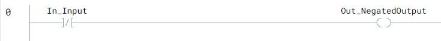

# What is Ladder Logic?

Ladder Logic is a graphical programming language used to program PLCs (Programmable Logic Controllers) in industrial automation systems.

It is called **Ladder Logic** because the program structure looks like a ladder:

- Two vertical lines represent the power rails.
- Horizontal lines, called **rungs**, contain the control logic.

Ladder Logic was designed to resemble traditional electrical relay circuits, making it easier for electricians and automation engineers to understand and troubleshoot.

A PLC continuously scans the ladder program from top to bottom and left to right. During each scan cycle, the PLC reads inputs, evaluates the logic conditions, and updates outputs accordingly.

Ladder Logic is widely used in industrial applications because it is:

- Easy to read and maintain
- Reliable for real-time control systems
- Simple to troubleshoot
- Well suited for automation and machine control

It is commonly used in systems such as:

- Motor control
- Conveyor systems
- Manufacturing automation
- Safety interlocks
- Process control systems

Ladder Logic primarily works with logical operations such as AND, OR, and NOT to control outputs based on input conditions.

Example:

# NOT Gate 

Implement a logical NOT gate that inverts a single BOOL input every scan and writes the negated result to the output.

# Parameters

| Name              | Type |  Usage | Description |
|-------------------|------|--------|-------------|
| In_Input          | BOOL | Input  | The boolean value to be negated. |
| Out_NegatedOutput | BOOL | Output | The negated result of the input. |

---

# Ladder Logic Diagram



### Explanation

This ladder logic implements a simple **NOT gate** operation.

- If `In_Input` is `TRUE`, the output `Out_NegatedOutput` becomes `FALSE`.
- If `In_Input` is `FALSE`, the output `Out_NegatedOutput` becomes `TRUE`.

The instruction continuously checks the input every PLC scan cycle and updates the output with the inverted state.

---

# Example Truth Table

| In_Input | Out_NegatedOutput |
|----------|-------------------|
| FALSE    | TRUE              |
| TRUE     | FALSE             |

---

# Example Logic Behavior

```text
Input  = TRUE
Output = FALSE
```

```text
Input  = FALSE
Output = TRUE
```

---

# Notes

- The NOT gate is one of the most basic digital logic operations.
- It is commonly used for signal inversion and safety logic.
- This instruction works with BOOL values only.

